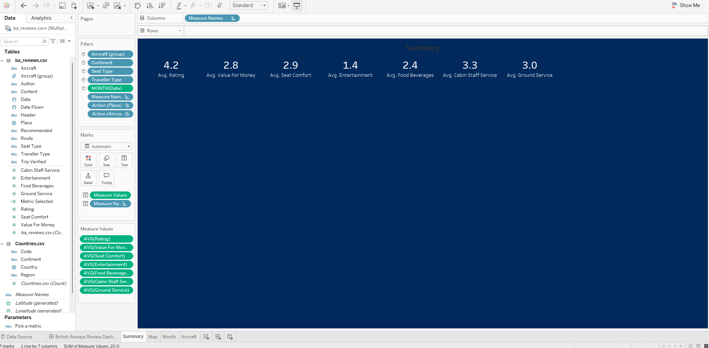
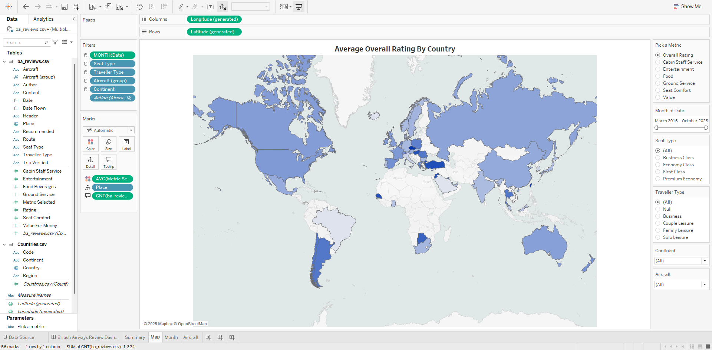
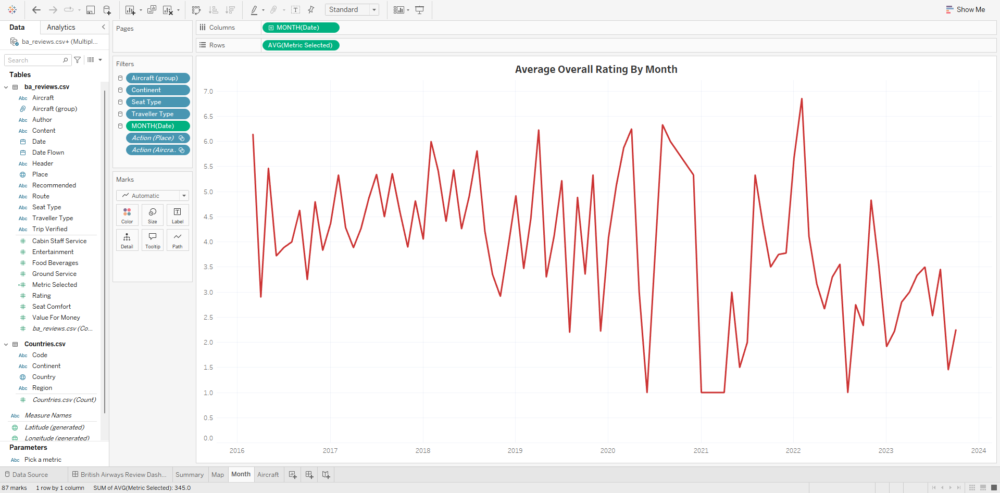
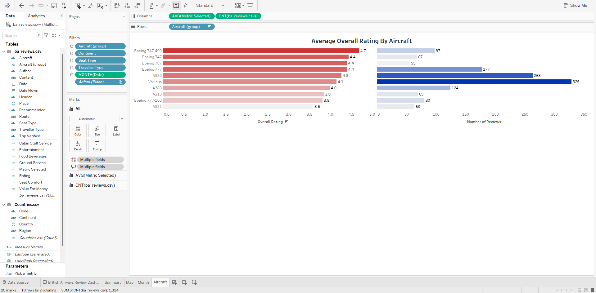

# Airline Flight Review Dashboard

## Project Overview

This Tableau dashboard delivers a comprehensive analysis of **British Airways flight reviews worldwide**, leveraging data from **airlinereviews.csv** and **countries.csv** to uncover actionable insights that can drive strategic decision-making and enhance customer experience.

The dashboard presents four powerful visualizations:

1. **Service Quality Assessment**: Shows strong overall satisfaction (4.2/5) while identifying high-impact improvement opportunities in entertainment (1.4/5) and food service (2.4/5).

2. **Global Satisfaction Mapping**: Pinpoints regional performance variations, enabling market-specific strategies that can elevate British Airways' competitive positioning in key territories.

3. **Customer Satisfaction History**: Tracks critical satisfaction trends from 2016-2024, revealing both seasonal patterns and recent declines that demand attention.

4. **Aircraft Satisfaction Comparison**: Identifies the Boeing 747-400 as the customer favorite (4.7/5 rating) while highlighting improvement opportunities for lower-performing aircraft models like the A321.

This dashboard transforms customer feedback into strategic intelligence, enabling data-driven decisions that can elevate British Airways' market position through targeted service improvements and enhanced customer satisfaction.

## Live Dashboard

## Key Features

- **Interactive Map** – Displays review distribution across different countries.
- **KPI Metrics** – Shows customer sentiment, average ratings, and key trends.
- **Dynamic Visualizations** – Enables filtering to explore review data efficiently.

## Data Sources

- **airlinereviews.csv** – Contains customer reviews and ratings.
- **countries.csv** – Provides country-level mapping for geographical analysis.

## Screenshots

Here are some screenshots of the supporting sheets:

*Overview dashboard presenting key performance metrics across seven service categories, highlighting strengths and opportunities for improvement in the customer experience.*

*World map visualization presenting average overall ratings by country with regions rendered in varying shades of blue to represent different satisfaction levels across global markets.*

*Line graph illustrating average overall ratings by month from 2016-2024, demonstrating significant fluctuations with notable performance decreases around 2020 and concerning downward trends in recent periods.*

*Bar chart displaying average overall ratings by aircraft type with Boeing 747-400 achieving the highest satisfaction (4.7) and A321 showing the lowest (3.6).*

## Next Steps

As my first Tableau project, I look forward to continuing to learn and implement more advanced features and discover innovative approaches to data representation that drive deeper insights.
