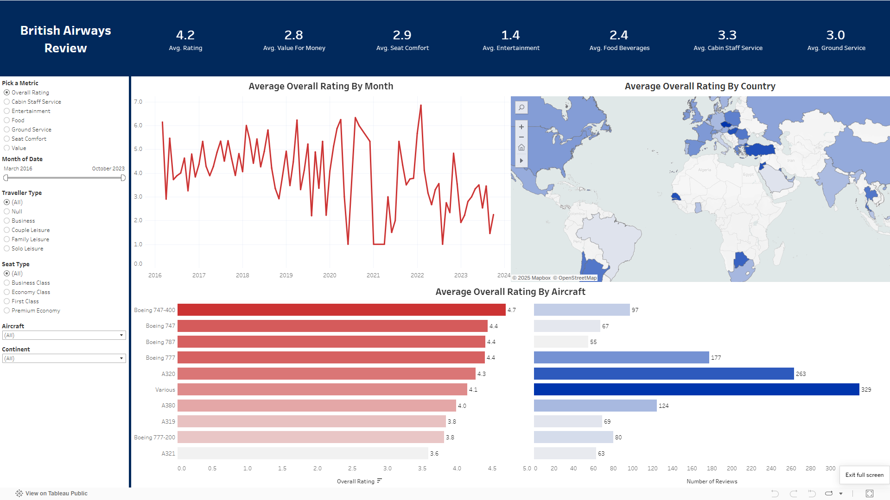

# British Airways Flight Reviews Dashboard  

## Project Overview  
This Tableau dashboard provides an interactive analysis of **British Airways flight reviews worldwide**, using **airlinereviews.csv** and **countries.csv**. It helps identify trends in customer sentiment, ratings, and regional performance.  

## Live Dashboard  

## Key Features  
- **Interactive Map** – Displays review distribution across different countries.  
- **KPI Metrics** – Shows customer sentiment, average ratings, and key trends.  
- **Dynamic Visualizations** – Enables filtering to explore review data efficiently.

## Data Sources  
- **airlinereviews.csv** – Contains customer reviews and ratings.  
- **countries.csv** – Provides country-level mapping for geographical analysis.  

## Tools & Technologies  
- **Tableau** – Data visualization  
- **Python & Pandas** (for preprocessing, if applicable)
